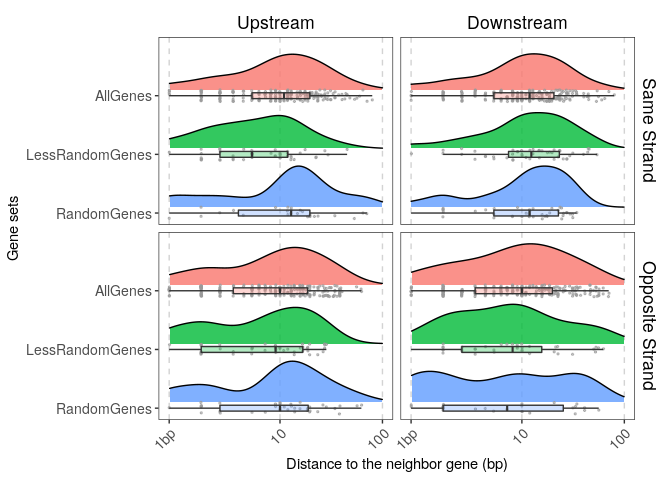

[](https://travis-ci.com/pgpmartin/GeneNeighborhood)
[](https://ci.appveyor.com/project/pgpmartin/GeneNeighborhood)
[](https://codecov.io/github/pgpmartin/GeneNeighborhood?branch=master)

<!-- README.md is generated from README.Rmd. Please edit that file -->

# GeneNeighborhood

The goal of GeneNeighborhood is to extract and analyze the orientation
and proximity of upstream/downstream genes.

## Installation

The development version of the GeneNeighborhood package can be installed
from [GitHub](https://github.com/) with:

``` r
# install.packages("devtools")
devtools::install_github("pgpmartin/GeneNeighborhood")
```

## Example

Load the library:

``` r
library(GeneNeighborhood)
```

### Obtain data on the gene neighbors

To run examples, the package includes a *GRanges* named **Genegr** that
contains 676 genes with random coordinates on a single chromosome
*Chr1*:

``` r
Genegr
#> GRanges object with 676 ranges and 0 metadata columns:
#>      seqnames    ranges strand
#>         <Rle> <IRanges>  <Rle>
#>   AA     Chr1 2876-2884      +
#>   AB     Chr1 7884-7886      +
#>   AC     Chr1 4090-4094      +
#>   AD     Chr1 8831-8835      +
#>   AE     Chr1 9405-9412      +
#>   ..      ...       ...    ...
#>   ZV     Chr1 5214-5220      +
#>   ZW     Chr1   863-868      +
#>   ZX     Chr1 2831-2836      +
#>   ZY     Chr1      4205      -
#>   ZZ     Chr1      5873      -
#>   -------
#>   seqinfo: 1 sequence from mock genome
```

For each feature/gene, we extract information (orientation and distance,
potential overlaps) about their upstream/downstream neighbors with:

``` r
GeneNeighbors <- getGeneNeighborhood(Genegr)
#> There are 96 genes (14.2%) that overlap with >1 gene
#> More than 10% of the genes overlap with multiple genes
```

### Analyze the orientation of the genes’ neighbors

We define a random set of 100 genes:

``` r
set.seed(1234)
randGenes <- sample(names(Genegr), 100)
```

We extract statistics about the orientation of their neighbors using:

``` r
## Neighbors Orientation Statistics:
NOS <- analyzeNeighborsOrientation(randGenes, 
                                   GeneNeighborhood = GeneNeighbors)
```

By default all genes are used as a universe and an enrichment test is
performed.  
By default, the function also analyzes the *“other”* orientation which
may be hard to interpret. We can remove this orientation using:

``` r
NOS <- analyzeNeighborsOrientation(randGenes, 
                                   GeneNeighborhood = GeneNeighbors,
                                   keepOther = FALSE)
#> Total number of genes in GeneList: 100 
#> Length of Gene Universe is 676 
#> 
#> Analysis of upstream gene orientation:
#> ======================================
#> 24 genes with 'other' info for their upstream gene are removed
#> Gene set for upstream gene analysis has 76 genes
#> 2 genes from universe have missing data for upstream gene
#> 157 genes from universe with 'other' info for their upstream gene are removed
#> Universe for upstream gene analysis has 517 genes
#> 
#> Analysis of downstream gene orientation:
#> ========================================
#> 24 genes with 'other' info for their downstream gene are removed
#> Gene set for downstream gene analysis has 76 genes
#> 1 genes from universe have missing data for downstream gene
#> 157 genes from universe with 'other' info for their downstream gene are removed
#> Universe for downstream gene analysis has 518 genes
```

We obtain the following
table:

| Side       | Orientation     |  n | Percentage | n\_Universe | Percentage\_Universe | p.value |
| :--------- | :-------------- | -: | ---------: | ----------: | -------------------: | ------: |
| Upstream   | OppositeOverlap |  4 |       5.26 |          35 |                 6.77 |  0.7900 |
| Upstream   | OppositeStrand  | 44 |      57.89 |         236 |                45.65 |  0.0140 |
| Upstream   | SameOverlap     |  1 |       1.32 |          31 |                 6.00 |  0.9900 |
| Upstream   | SameStrand      | 27 |      35.53 |         215 |                41.59 |  0.9000 |
| Downstream | OppositeOverlap |  2 |       2.63 |          16 |                 3.09 |  0.7100 |
| Downstream | OppositeStrand  | 27 |      35.53 |         248 |                47.88 |  0.9900 |
| Downstream | SameOverlap     |  3 |       3.95 |          31 |                 5.98 |  0.8600 |
| Downstream | SameStrand      | 44 |      57.89 |         223 |                43.05 |  0.0036 |

We can plot the corresponding percentages using:

``` r
plotNeighborsOrientation(NOS)
```


### Analyze the proximity of the genes’ neighbors

For a set of genes (here all genes), we can extract the distances to the
upstream/downstream gene neighbors by:

``` r
alldist <- dist2Neighbors(GeneNeighborhood = GeneNeighbors,
                          geneset = GeneNeighbors$GeneName,
                          genesetName = "AllGenes")
#> Initial number of genes in geneset (NA removed): 676
#> 159 genes with undefined upstream gene are removed from Geneset
#> 66 genes with an overlapping upstream gene are removed from Geneset
#> Final number of genes with upstream gene data: 451 genes
#> 158 genes with undefined downstream gene are removed from Geneset
#> 47 genes with an overlapping downstream gene are removed from Geneset
#> Final number of genes with downstream gene data: 471 genes
```

We can use these distances to select genes with short upstream
distances.  
First we create a vector of upstream distances:

``` r
updist <- alldist$Distance[alldist$Side == "Upstream"]
names(updist) <- alldist$GeneName[alldist$Side == "Upstream"]
```

Then we define a probability of selecting the gene that is inversely
proportional to its upstream distance:

``` r
probs <- (max(updist) - updist) / sum(max(updist) - updist)
```

Then select 100 genes using these probabilities:

``` r
set.seed(1234)
lessRandGenes <- sample(names(updist), 100, prob = probs)
```

We now have:

  - A set of 100 random genes (`randGenes`)  
  - A set of 100 genes that tend to have short upstream intergenic
    distances (`lessRandGenes`)  
  - A “gene universe” (all genes that are analyzed and have defined
    neighbors)

We assemble these in a list:

``` r
MyGeneSets <- list("RandomGenes" = randGenes,
                   "LessRandomGenes" = lessRandGenes,
                   "AllGenes" = GeneNeighbors$GeneName)
```

For each gene in each gene set, we extract the distances to their
neighbors:

``` r
Dist2GeneSets <- dist2Neighbors(GeneNeighbors, MyGeneSets)
#> Initial number of genes in gene sets (NA removed): 
#> RandomGenes: 100 genes
#> LessRandomGenes: 100 genes
#> AllGenes: 676 genes
#> 
#> Geneset: RandomGenes
#> 24 genes with undefined upstream gene are removed from Geneset
#> 5 genes with an overlapping upstream gene are removed from Geneset
#> Final number of genes with upstream gene data: 71 genes
#> 24 genes with undefined downstream gene are removed from Geneset
#> 5 genes with an overlapping downstream gene are removed from Geneset
#> Final number of genes with downstream gene data: 71 genes
#> 
#> Geneset: LessRandomGenes
#> Final number of genes with upstream gene data: 100 genes
#> 11 genes with an overlapping downstream gene are removed from Geneset
#> Final number of genes with downstream gene data: 89 genes
#> 
#> Geneset: AllGenes
#> 159 genes with undefined upstream gene are removed from Geneset
#> 66 genes with an overlapping upstream gene are removed from Geneset
#> Final number of genes with upstream gene data: 451 genes
#> 158 genes with undefined downstream gene are removed from Geneset
#> 47 genes with an overlapping downstream gene are removed from Geneset
#> Final number of genes with downstream gene data: 471 genes
```

Now we can obtain descriptive statistics on these distances:

``` r
MyDistStats <- distStats(Dist2GeneSets, 
                         confLevel = 0.95,
                         nboot = 100, 
                         CItype="perc",
                         ncores = 2)
```

The function also calculates bootstrap confidence intervals for the mean
and median using the `boot` package.  
**Note:** *To reduce computation time, we use only 100 boostrap samples
to compute the confidence intervals of the mean and median but a value
at least equal to the default 1e4 should be preferred. The function also
supports parallel computing (not available on Windows) via the `ncores`
argument*

We obtain the following table of
statistics:

| Orientation    | Side       | GeneSet         |   n | Min | Q1 | Median | Median\_LowerCI | Median\_UpperCI | Mean | Mean\_LowerCI | Mean\_UpperCI | Q3 | Max | SD | SEM |
| :------------- | :--------- | :-------------- | --: | --: | -: | -----: | --------------: | --------------: | ---: | ------------: | ------------: | -: | --: | -: | --: |
| OppositeStrand | Upstream   | RandomGenes     |  44 |   0 |  2 |     10 |               5 |              15 |   14 |            10 |            19 | 19 |  63 | 15 |   2 |
| SameStrand     | Upstream   | RandomGenes     |  27 |   0 |  4 |     13 |              11 |              19 |   18 |            11 |            23 | 20 |  71 | 19 |   4 |
| SameStrand     | Downstream | RandomGenes     |  44 |   0 |  5 |     12 |              10 |              19 |   14 |            11 |            18 | 23 |  35 | 10 |   2 |
| OppositeStrand | Downstream | RandomGenes     |  27 |   0 |  1 |      7 |               1 |              10 |   14 |             6 |            20 | 26 |  57 | 17 |   3 |
| SameStrand     | Upstream   | LessRandomGenes |  50 |   0 |  2 |      5 |               3 |              10 |    9 |             5 |            11 | 12 |  46 |  9 |   1 |
| OppositeStrand | Upstream   | LessRandomGenes |  50 |   0 |  1 |      9 |               4 |              11 |   10 |             7 |            12 | 17 |  29 |  9 |   1 |
| OppositeStrand | Downstream | LessRandomGenes |  39 |   0 |  2 |      8 |               4 |              10 |   14 |             9 |            20 | 16 |  63 | 18 |   3 |
| SameStrand     | Downstream | LessRandomGenes |  50 |   0 |  7 |     12 |               9 |              16 |   16 |            13 |            19 | 24 |  55 | 13 |   2 |
| OppositeStrand | Upstream   | AllGenes        | 236 |   0 |  3 |     10 |               9 |              12 |   13 |            12 |            15 | 19 |  63 | 12 |   1 |
| SameStrand     | Upstream   | AllGenes        | 215 |   0 |  5 |     11 |              10 |              12 |   14 |            13 |            16 | 20 |  80 | 14 |   1 |
| OppositeStrand | Downstream | AllGenes        | 248 |   0 |  3 |     10 |               8 |              11 |   15 |            13 |            17 | 20 |  71 | 16 |   1 |
| SameStrand     | Downstream | AllGenes        | 223 |   0 |  5 |     12 |              10 |              13 |   15 |            13 |            17 | 21 |  80 | 14 |   1 |

We can perform statistical tests to evaluate if the distances observed
in a gene set are significantly different from the distances observed in
the universe. Because there are different ways to formulate this
question, the `distTests` function provides the p-values for different
tests (see the vignette for details):

``` r
MyDistTests <- distTests(Dist2GeneSets,
                         Universe = "AllGenes",
                         MedianResample = TRUE,
                         R = 1e3)
```

Table:

| GeneSet         | Orientation    | Side       | KS.pvalue | Wilcox.pvalue | Indep.pvalue | Median\_resample.pvalue |
| :-------------- | :------------- | :--------- | --------: | ------------: | -----------: | ----------------------: |
| LessRandomGenes | SameStrand     | Upstream   |   0.00038 |       8.9e-05 |      0.00051 |                    0.00 |
| LessRandomGenes | OppositeStrand | Upstream   |   0.26000 |       4.8e-02 |      0.03100 |                    0.23 |
| LessRandomGenes | SameStrand     | Downstream |   0.94000 |       3.2e-01 |      0.43000 |                    0.82 |
| LessRandomGenes | OppositeStrand | Downstream |   0.30000 |       3.3e-01 |      0.78000 |                    0.29 |
| RandomGenes     | SameStrand     | Upstream   |   0.31000 |       5.7e-01 |      0.22000 |                    0.90 |
| RandomGenes     | OppositeStrand | Upstream   |   0.89000 |       9.9e-01 |      0.63000 |                    0.56 |
| RandomGenes     | SameStrand     | Downstream |   0.45000 |       5.6e-01 |      0.77000 |                    0.72 |
| RandomGenes     | OppositeStrand | Downstream |   0.21000 |       2.5e-01 |      0.77000 |                    0.19 |

Now, we can plot the distribution of intergenic distances for these sets
of genes:

``` r
plotDistanceDistrib(Dist2GeneSets,
                    type = "jitterbox")
```



### Metagene profiles

Another way to study the neighborhood of a set of genes is to produce an
average profiles representing the coverage of annotations in regions
surrounding this set of genes. Such representation provides information
on both the orientation and the distance of the neighbors. It also
allows to compare different groups of genes (e.g. upregulated genes,
genes with a ChIP-seq peak or a specific transcription factor motif in
their promoter, etc…).

First we extract the profiles of annotations around (+/-50bp) all our
“mock” genes.  
We use 3 bins to summarize the coverage on the gene body so genes of
size \<3bp are removed.  
We also use the argument *usePercent=TRUE* so that the profiles only
indicate the presence/absence (0/1) of an annotation at a position
rather than the number of genes that cover this position.

``` r
usePercent = TRUE
Prof <- annotationCoverageAroundFeatures(Genegr,
                                         sidedist = 50,
                                         usePercent = usePercent,
                                         nbins=3)
#> 4 windows exceeding chromosome borders are removed
#> Features are binned using binFeatureProfiles
#> Removing 136 features of size lower than 3bp
#> Bin size is: 2.13 +/- 0.74bp (mean +/- sd)
```

The object that is created by this function contains the following
elements:

    #> Feature_Sense
    #> Feature_Antisense
    #> UpstreamBorder_Sense
    #> UpstreamBorder_Antisense
    #> DownstreamBorder_Sense
    #> DownstreamBorder_Antisense

They represent the strand-specific coverage of annotations on the gene
body (*Feature*), in the region (-50bp to the start of the gene) located
upstream of the genes (*UpstreamBorder*) and in the region (end of the
gene to +50bp) located downstream of the genes (*DownstreamBorder*).  
The *Sense* strand is the strand on which the focus gene (*Feature*) is
annotated and the *Antisense* strand is the opposite strand.  
Because we used *usePercent=TRUE*, the *Feature\_Sense* profiles will
only contain 1s, indicating the presence of annotation(s) all along the
body of each focus gene (i.e. annotation of the focus gene itself). When
*usePercent=FALSE*, values \>1 can occur in these profile, when the
focus gene overlaps with other genes annotated on the same strand.

Then, we assemble these different elements in order to produce a vector
for each focus gene containing the upstream region (-50bp to the TSS),
the gene body itself and the downstream region (TES to +50bp).

``` r
Prof <- assembleProfiles(Prof)
```

Now we define a group of genes that have neighbors, on the same strand,
at a short distance.

``` r
#Get distances to the closest gene on the same strand:
Dist2Nearest <- mcols(distanceToNearest(Genegr))$distance
CloseTandemNeighbors <- names(Genegr)[Dist2Nearest<=8]
```

We assemble the different groups of genes that we have defined so far in
a list:

``` r
GeneGroups <- list(All = names(Genegr),
                   Random = randGenes,
                   CloseNeighbors = CloseTandemNeighbors)
```

Then, for each group of genes, we calculate the average profile and its
95% confidence interval:

``` r
avgProf <- list()
for (i in 1:length(GeneGroups)) {
  avgProf[[i]] <- list()
  avgProf[[i]]$sense <- getAvgProfileWithCI(Prof$Profiles_Sense,
                                            selFeatures = GeneGroups[[i]],
                                            pos = c(-50:0, 1:3, 0:50))
  avgProf[[i]]$antisense <- getAvgProfileWithCI(Prof$Profiles_Antisense,
                                                selFeatures = GeneGroups[[i]],
                                                pos = c(-50:0, 1:3, 0:50))
}
names(avgProf) <- names(GeneGroups)
```

Before plotting, we need to assemble these profiles in a single table
and to provide the x-coordinates for these “metagene” profiles (in the
interval \[0,5\] with the gene body occupying coordinates
\]2,3\[).

``` r
#Define the x-coordinates (the 3 sequences correspond to "Upstream", "GeneBody" and "Downstream")
xcoord = c(seq(0, 2, length.out = 51),
           seq(2, 3, length.out = 5)[2:4],
           seq(3, 5, length.out = 51))
#Assemble the metagene profiles
avgProf_df <- reshape2::melt(avgProf,
                             measure.vars = "Profile", value.name = "Profile") %>%
                  dplyr::rename("Strand" = "L2",
                                "GeneSet" = "L1") %>%
                  dplyr::mutate(Xcoord=rep(xcoord, 2*length(GeneGroups)))
```

Now we can plot these profiles using:

``` r
plotMetageneAnnotProfile(avgProf_df)
```


### Distance to single-point features

One limitation of these average profiles is that all the length of the
genes/features are taken into account to produce the profiles.
Sometimes, we are interested only in one part of this information. For
example, we may want to know how many genes (or what fraction of genes)
have a TSS, on the same strand, at less than 20bp from their end? The
metagene profiles above can provide an approximation but not the true
value because some features actually start and end within this interval.
The TSSs are *single-point features*. We can produce a coverage of the
TSS using:

``` r
#First obtain the coordinates of the TSS:
tss <- GenomicRanges::promoters(Genegr, upstream = 0, downstream = 1)
#Then the coverage of TSSs around (+/- 50bp) the genes
tsscov <- annotationCoverageAroundFeatures(annot = tss, 
                                           features = Genegr, 
                                           sidedist = 50, 
                                           usePercent = TRUE,
                                           nbins = 3)
#> 4 windows exceeding chromosome borders are removed
#> Features are binned using binFeatureProfiles
#> Removing 136 features of size lower than 3bp
#> Bin size is: 2.13 +/- 0.74bp (mean +/- sd)
#> Removing 136 features of size lower than 3bp
#> Bin size is: 2.13 +/- 0.74bp (mean +/- sd)
```

But metagene plots as above will not work well because the data is too
sparse.  
Instead, once a TSS is found at, say 5bp downstream of a gene border, we
would like to extend its “presence” value (1) to any distance larger
than 5bp to indicate that this specific gene has a TSS at less than any
distance larger than 5. We do this using:

``` r
extTSScov <- extendPointPresence(tsscov, sidedist = 50)
```

Now for different groups of genes we can obtain the cumulative
percentage of genes that have a TSS at less than a given distance with:

``` r
CP <- getCumulPercentProfiles(extTSScov,
                              genesets = GeneGroups)
```

And plot the results
with:

``` r
plotCumulPercentProfile(CP)
```


