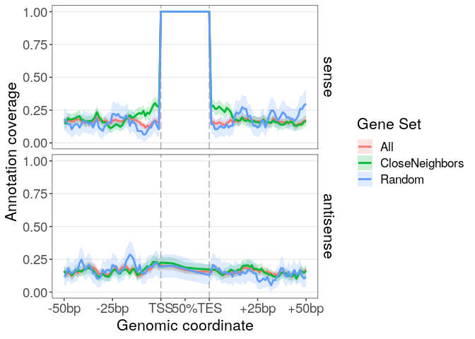

<!-- README.md is generated from README.Rmd. Please edit that file -->
GeneNeighborhood
================

The goal of GeneNeighborhood is to extract and analyze the orientation and proximity of upstream/downstream genes.

Installation
------------

(NOT THERE YET!) You can install the released version of GeneNeighborhood from [CRAN](https://CRAN.R-project.org) with:

``` r
install.packages("GeneNeighborhood")
```

And the development version from [GitHub](https://github.com/) with:

``` r
# install.packages("devtools")
devtools::install_github("pgpmartin/GeneNeighborhood")
```

Example
-------

Load the library:

``` r
library(GeneNeighborhood)
```

### Obtain data on the gene neighbors

To run examples, the package includes a *GRanges* named **Genegr** that contains 676 genes with random coordinates on a single chromosome *Chr1*:

``` r
Genegr
#> GRanges object with 676 ranges and 0 metadata columns:
#>      seqnames       ranges strand
#>         <Rle>    <IRanges>  <Rle>
#>   AA     Chr1 [2876, 2884]      +
#>   AB     Chr1 [7884, 7886]      +
#>   AC     Chr1 [4090, 4094]      +
#>   AD     Chr1 [8831, 8835]      +
#>   AE     Chr1 [9405, 9412]      +
#>   ..      ...          ...    ...
#>   ZV     Chr1 [5214, 5220]      +
#>   ZW     Chr1 [ 863,  868]      +
#>   ZX     Chr1 [2831, 2836]      +
#>   ZY     Chr1 [4205, 4205]      -
#>   ZZ     Chr1 [5873, 5873]      -
#>   -------
#>   seqinfo: 1 sequence from mock genome
```

For each feature/gene, we extract information (orientation and distance, potential overlaps) about their upstream/downstream neighbors with:

``` r
GeneNeighbors <- getGeneNeighborhood(Genegr)
#> There are 96 genes (14.2%) that overlap with >1 gene
#> More than 10% of the genes overlap with multiple genes
```

### Analyze the orientation of the genes' neighbors

We define a random set of 100 genes:

``` r
set.seed(123)
randGenes <- sample(names(Genegr), 100)
```

We extract statistics about the orientation of their neighbors using:

``` r
## Neighbors Orientation Statistics:
NOS <- analyzeNeighborsOrientation(randGenes, 
                                   GeneNeighborhood = GeneNeighbors)
```

By default all genes are used as a universe and an enrichment test is performed.
By default, the function also analyzes the *"other"* orientation which may be hard to interpret. We can remove this orientation using:

``` r
NOS <- analyzeNeighborsOrientation(randGenes, 
                                   GeneNeighborhood = GeneNeighbors,
                                   keepOther = FALSE)
#> Total number of genes in GeneList: 100 
#> Length of Gene Universe is 676 
#> 
#> Analysis of upstream gene orientation:
#> ======================================
#> 21 genes with 'other' info for their upstream gene are removed
#> Gene set for upstream gene analysis has 79 genes
#> 2 genes from universe have missing data for upstream gene
#> 157 genes from universe with 'other' info for their upstream gene are removed
#> Universe for upstream gene analysis has 517 genes
#> 
#> Analysis of downstream gene orientation:
#> ========================================
#> 21 genes with 'other' info for their downstream gene are removed
#> Gene set for downstream gene analysis has 79 genes
#> 1 genes from universe have missing data for downstream gene
#> 157 genes from universe with 'other' info for their downstream gene are removed
#> Universe for downstream gene analysis has 518 genes
```

We obtain the following table:

| Side       | Orientation     |    n|  Percentage|  n\_Universe|  Percentage\_Universe|  p.value|
|:-----------|:----------------|----:|-----------:|------------:|---------------------:|--------:|
| Upstream   | OppositeOverlap |    4|        5.06|           35|                  6.77|    0.810|
| Upstream   | OppositeStrand  |   38|       48.10|          236|                 45.65|    0.360|
| Upstream   | SameOverlap     |    4|        5.06|           31|                  6.00|    0.730|
| Upstream   | SameStrand      |   33|       41.77|          215|                 41.59|    0.530|
| Downstream | OppositeOverlap |    5|        6.33|           16|                  3.09|    0.081|
| Downstream | OppositeStrand  |   40|       50.63|          248|                 47.88|    0.340|
| Downstream | SameOverlap     |    4|        5.06|           31|                  5.98|    0.720|
| Downstream | SameStrand      |   30|       37.97|          223|                 43.05|    0.870|

We can plot the corresponding percentages using:

``` r
plotNeighborsOrientation(NOS)
```


### Analyze the proximity of the genes' neighbors

We can analyze specifically the distances to the upstream genes with:

``` r
randUpstreamDist <- statDistanceSide(GeneNeighborhood = GeneNeighbors,
                                     glist = randGenes,
                                     Side = "Upstream")
```

Which gives the following (simplified) table:

| GeneGroup    | SideClass      |    n|  Median|   Mean|     SD|  KS.pvalue|  Wilcox.pvalue|  Independ.pvalue|
|:-------------|:---------------|----:|-------:|------:|------:|----------:|--------------:|----------------:|
| GeneList     | OppositeStrand |   38|     9.5|  14.47|  13.81|       0.65|           0.63|             0.52|
| GeneList     | SameStrand     |   33|    10.0|  13.00|   9.80|       0.91|           0.98|             0.51|
| GeneUniverse | OppositeStrand |  236|    10.0|  13.30|  12.43|         NA|             NA|               NA|
| GeneUniverse | SameStrand     |  215|    11.0|  14.47|  13.80|         NA|             NA|               NA|

Or we directly analyze the distances to both upstream and downstream genes:

``` r
randDist <- analyzeNeighborsDistance(GeneList = randGenes,
                                     GeneNeighborhood = GeneNeighbors)
```

Which gives the following (simplified) table:

<table>
<colgroup>
<col width="12%" />
<col width="10%" />
<col width="14%" />
<col width="4%" />
<col width="7%" />
<col width="6%" />
<col width="6%" />
<col width="9%" />
<col width="13%" />
<col width="15%" />
</colgroup>
<thead>
<tr class="header">
<th align="left">GeneGroup</th>
<th align="left">Side</th>
<th align="left">Orientation</th>
<th align="right">n</th>
<th align="right">Median</th>
<th align="right">Mean</th>
<th align="right">SD</th>
<th align="right">KS.pvalue</th>
<th align="right">Wilcox.pvalue</th>
<th align="right">Independ.pvalue</th>
</tr>
</thead>
<tbody>
<tr class="odd">
<td align="left">GeneList</td>
<td align="left">Upstream</td>
<td align="left">OppositeStrand</td>
<td align="right">38</td>
<td align="right">9.5</td>
<td align="right">14.47</td>
<td align="right">13.81</td>
<td align="right">0.65</td>
<td align="right">0.63</td>
<td align="right">0.520</td>
</tr>
<tr class="even">
<td align="left">GeneList</td>
<td align="left">Upstream</td>
<td align="left">SameStrand</td>
<td align="right">33</td>
<td align="right">10.0</td>
<td align="right">13.00</td>
<td align="right">9.80</td>
<td align="right">0.91</td>
<td align="right">0.98</td>
<td align="right">0.510</td>
</tr>
<tr class="odd">
<td align="left">GeneUniverse</td>
<td align="left">Upstream</td>
<td align="left">OppositeStrand</td>
<td align="right">236</td>
<td align="right">10.0</td>
<td align="right">13.30</td>
<td align="right">12.43</td>
<td align="right">NA</td>
<td align="right">NA</td>
<td align="right">NA</td>
</tr>
<tr class="even">
<td align="left">GeneUniverse</td>
<td align="left">Upstream</td>
<td align="left">SameStrand</td>
<td align="right">215</td>
<td align="right">11.0</td>
<td align="right">14.47</td>
<td align="right">13.80</td>
<td align="right">NA</td>
<td align="right">NA</td>
<td align="right">NA</td>
</tr>
<tr class="odd">
<td align="left">GeneList</td>
<td align="left">Downstream</td>
<td align="left">OppositeStrand</td>
<td align="right">40</td>
<td align="right">7.0</td>
<td align="right">15.20</td>
<td align="right">18.69</td>
<td align="right">0.62</td>
<td align="right">0.50</td>
<td align="right">0.810</td>
</tr>
<tr class="even">
<td align="left">GeneList</td>
<td align="left">Downstream</td>
<td align="left">SameStrand</td>
<td align="right">30</td>
<td align="right">15.5</td>
<td align="right">18.70</td>
<td align="right">15.54</td>
<td align="right">0.29</td>
<td align="right">0.10</td>
<td align="right">0.098</td>
</tr>
<tr class="odd">
<td align="left">GeneUniverse</td>
<td align="left">Downstream</td>
<td align="left">OppositeStrand</td>
<td align="right">248</td>
<td align="right">10.0</td>
<td align="right">14.65</td>
<td align="right">15.66</td>
<td align="right">NA</td>
<td align="right">NA</td>
<td align="right">NA</td>
</tr>
<tr class="even">
<td align="left">GeneUniverse</td>
<td align="left">Downstream</td>
<td align="left">SameStrand</td>
<td align="right">223</td>
<td align="right">12.0</td>
<td align="right">14.85</td>
<td align="right">13.69</td>
<td align="right">NA</td>
<td align="right">NA</td>
<td align="right">NA</td>
</tr>
</tbody>
</table>

The function can also be used to extract intergenic distances for all genes (except those with overlapping genes):

``` r
alldist <- analyzeNeighborsDistance(GeneList = names(Genegr),
                                    GeneNeighborhood = GeneNeighbors,
                                    DistriTest = FALSE)
```

We can use these distances to preferentially select genes with a short upstream distance.
First, we extract upstream distances:

``` r
updist <- alldist$distances$Distance[alldist$distances$Side=="Upstream"]
names(updist) <- alldist$distances$GeneName[alldist$distances$Side=="Upstream"]
```

Then we define a probability of selecting the gene that is inversely proportional to its upstream distance:

``` r
probs <- (max(updist) - updist) / sum(max(updist) - updist)
```

Then select 100 genes using these probabilities:

``` r
set.seed(1234)
lessRandGenes <- sample(names(updist), 100, prob=probs)
```

And finally analyze the intergenic distances with these genes' neighbors:

``` r
lessRandDist <- analyzeNeighborsDistance(GeneList = lessRandGenes,
                                         GeneNeighborhood = GeneNeighbors)
```

We obtain the following (simplified) table:

<table>
<colgroup>
<col width="12%" />
<col width="10%" />
<col width="14%" />
<col width="4%" />
<col width="7%" />
<col width="6%" />
<col width="6%" />
<col width="9%" />
<col width="13%" />
<col width="15%" />
</colgroup>
<thead>
<tr class="header">
<th align="left">GeneGroup</th>
<th align="left">Side</th>
<th align="left">Orientation</th>
<th align="right">n</th>
<th align="right">Median</th>
<th align="right">Mean</th>
<th align="right">SD</th>
<th align="right">KS.pvalue</th>
<th align="right">Wilcox.pvalue</th>
<th align="right">Independ.pvalue</th>
</tr>
</thead>
<tbody>
<tr class="odd">
<td align="left">GeneList</td>
<td align="left">Upstream</td>
<td align="left">OppositeStrand</td>
<td align="right">50</td>
<td align="right">9.0</td>
<td align="right">9.92</td>
<td align="right">9.12</td>
<td align="right">0.26000</td>
<td align="right">4.8e-02</td>
<td align="right">0.03100</td>
</tr>
<tr class="even">
<td align="left">GeneList</td>
<td align="left">Upstream</td>
<td align="left">SameStrand</td>
<td align="right">50</td>
<td align="right">5.0</td>
<td align="right">8.52</td>
<td align="right">9.05</td>
<td align="right">0.00038</td>
<td align="right">8.9e-05</td>
<td align="right">0.00051</td>
</tr>
<tr class="odd">
<td align="left">GeneUniverse</td>
<td align="left">Upstream</td>
<td align="left">OppositeStrand</td>
<td align="right">236</td>
<td align="right">10.0</td>
<td align="right">13.30</td>
<td align="right">12.43</td>
<td align="right">NA</td>
<td align="right">NA</td>
<td align="right">NA</td>
</tr>
<tr class="even">
<td align="left">GeneUniverse</td>
<td align="left">Upstream</td>
<td align="left">SameStrand</td>
<td align="right">215</td>
<td align="right">11.0</td>
<td align="right">14.47</td>
<td align="right">13.80</td>
<td align="right">NA</td>
<td align="right">NA</td>
<td align="right">NA</td>
</tr>
<tr class="odd">
<td align="left">GeneList</td>
<td align="left">Downstream</td>
<td align="left">OppositeStrand</td>
<td align="right">39</td>
<td align="right">8.0</td>
<td align="right">14.00</td>
<td align="right">17.84</td>
<td align="right">0.30000</td>
<td align="right">3.3e-01</td>
<td align="right">0.78000</td>
</tr>
<tr class="even">
<td align="left">GeneList</td>
<td align="left">Downstream</td>
<td align="left">SameStrand</td>
<td align="right">50</td>
<td align="right">12.5</td>
<td align="right">16.18</td>
<td align="right">13.35</td>
<td align="right">0.94000</td>
<td align="right">3.2e-01</td>
<td align="right">0.43000</td>
</tr>
<tr class="odd">
<td align="left">GeneUniverse</td>
<td align="left">Downstream</td>
<td align="left">OppositeStrand</td>
<td align="right">248</td>
<td align="right">10.0</td>
<td align="right">14.65</td>
<td align="right">15.66</td>
<td align="right">NA</td>
<td align="right">NA</td>
<td align="right">NA</td>
</tr>
<tr class="even">
<td align="left">GeneUniverse</td>
<td align="left">Downstream</td>
<td align="left">SameStrand</td>
<td align="right">223</td>
<td align="right">12.0</td>
<td align="right">14.85</td>
<td align="right">13.69</td>
<td align="right">NA</td>
<td align="right">NA</td>
<td align="right">NA</td>
</tr>
</tbody>
</table>

Before plotting, we need to assemble the distances for different groups of genes in a single data frame:

``` r
mydist <- rbind.data.frame(alldist$distances,
                           randDist$distances,
                           lessRandDist$distances)
mydist$GeneSet <- rep(c("All Genes", "Random Genes", "Less Random genes"),
                      times = c(nrow(alldist$distances), 
                                nrow(randDist$distances), 
                                nrow(lessRandDist$distances)))
```

Now, we can plot the distribution of intergenic distances for these sets of genes:

``` r
plotDistanceDensities(mydist)
```


### Metagene profiles

Another way to study the neighborhood of a set of genes is to produce an average profiles representing the coverage of annotations in regions surrounding this set of genes. Such representation provides information on both the orientation and the distance of the neighbors. It also allows to compare different groups of genes (e.g. upregulated genes, genes with a ChIP-seq peak or a specific transcription factor motif in their promoter, etc...).

First we extract the profiles of annotations around (+/-50bp) all our "mock" genes.
We use 3 bins to summarize the coverage on the gene body so genes of size &lt;3bp are removed.
We also use the argument *usePercent=TRUE* so that the profiles only indicate the presence/absence (0/1) of an annotation at a position rather than the number of genes that cover this position.

``` r
usePercent = TRUE
Prof <- annotationCoverageAroundFeatures(Genegr,
                                         sidedist = 50,
                                         usePercent = usePercent,
                                         nbins=3)
#> 4 windows exceeding chromosome borders are removed
#> Features are binned using binFeatureProfiles
#> Removing 136 features of size lower than 3bp
#> Bin size is: 2.13 +/- 0.74bp (mean +/- sd)
```

The object that is created by this function contains the following elements:

    #> Feature_Sense
    #> Feature_Antisense
    #> UpstreamBorder_Sense
    #> UpstreamBorder_Antisense
    #> DownstreamBorder_Sense
    #> DownstreamBorder_Antisense

They represent the strand-specific coverage of annotations on the gene body (*Feature*), in the region (-50bp to the start of the gene) located upstream of the genes (*UpstreamBorder*) and in the region (end of the gene to +50bp) located downstream of the genes (*DownstreamBorder*).
The *Sense* strand is the strand on which the focus gene (*Feature*) is annotated and the *Antisense* strand is the opposite strand.
Because we used *usePercent=TRUE*, the *Feature\_Sense* profiles will only contain 1s, indicating the presence of annotation(s) all along the body of each focus gene (i.e. annotation of the focus gene itself). When *usePercent=FALSE*, values &gt;1 can occur in these profile, when the focus gene overlaps with other genes annotated on the same strand.

Then, we assemble these different elements in order to produce a vector for each focus gene containing the upstream region (-50bp to the TSS), the gene body itself and the downstream region (TES to +50bp).

``` r
Prof <- assembleProfiles(Prof)
```

Now we define a group of genes that have neighbors, on the same strand, at a short distance.

``` r
#Get distances to the closest gene on the same strand:
Dist2Nearest <- mcols(distanceToNearest(Genegr))$distance
CloseTandemNeighbors <- names(Genegr)[Dist2Nearest<=8]
```

We assemble the different groups of genes that we have defined so far in a list:

``` r
GeneGroups <- list(All = names(Genegr),
                   Random = randGenes,
                   CloseNeighbors = CloseTandemNeighbors)
```

Then, for each group of genes, we calculate the average profile and its 95% confidence interval:

``` r
avgProf <- list()
for (i in 1:length(GeneGroups)) {
  avgProf[[i]] <- list()
  avgProf[[i]]$sense <- getAvgProfileWithCI(Prof$Profiles_Sense,
                                            selFeatures = GeneGroups[[i]],
                                            pos = c(-50:0, 1:3, 0:50))
  avgProf[[i]]$antisense <- getAvgProfileWithCI(Prof$Profiles_Antisense,
                                                selFeatures = GeneGroups[[i]],
                                                pos = c(-50:0, 1:3, 0:50))
}
names(avgProf) <- names(GeneGroups)
```

Before plotting, we need to assemble these profiles in a single table and to provide the x-coordinates for these "metagene" profiles (in the interval \[0,5\] with the gene body occupying coordinates \]2,3\[).

``` r
#Define the x-coordinates (the 3 sequences correspond to "Upstream", "GeneBody" and "Downstream")
xcoord = c(seq(0, 2, length.out = 51),
           seq(2, 3, length.out = 5)[2:4],
           seq(3, 5, length.out = 51))
#Assemble the metagene profiles
avgProf_df <- reshape2::melt(avgProf,
                             measure.vars = "Profile", value.name = "Profile") %>%
                  dplyr::rename("Strand" = "L2",
                                "GeneSet" = "L1") %>%
                  dplyr::mutate(Xcoord=rep(xcoord, 2*length(GeneGroups)))
```

Now we can plot these profiles using:

``` r
plotMetageneAnnotProfile(avgProf_df)
```


