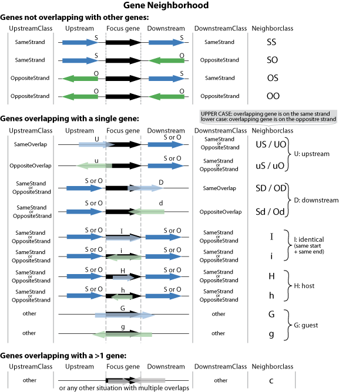

```{r setup, include = FALSE}
knitr::opts_chunk$set(
  collapse = TRUE,
  comment = "#>"
)
```

  The GeneNeighborhood package provides statistical and graphical tools to analyze the direct neighborhood of sets of genes (called the "focus genes"). Here, "direct neighborhood" means the first upstream and downstream gene neighbors. We're interested in evaluating if these neighbors are enriched for a specific orientation/configuration and/or if their distance to the focus genes is shorter or larger than expected by chance.   

The main questions that this package addresses are, for a given set of focus genes:  

* Are the upstream or downstream neighbors in a specific orientation? Do they tend to overlap the focus genes more than expected?  

* For non overlapping upstream or downstream neighbors, do they tend to be closer or farther from the focus genes than expected?  

* More generally, do annotations located in the vicinity of the focus genes reveal any pattern compared to other sets of genes?  


## Let's start

### Load libraries
Load the library:
```{r load libraries}
library(GeneNeighborhood)
```
   
Throughout this vignette, we will also use other packages:
```{r, message=FALSE, warning=FALSE}
library(GenomeInfoDb)
```


```{r load hidden libs, include = FALSE}
library(knitr)
library(dplyr)
library(reshape2)
library(GenomicRanges)
```
   
   
### Get some data

The GeneNeighborhood package provides a toy dataset named `Genegr` that is used in the README file on [Github](https://github.com/pgpmartin/GeneNeighborhood) and throughout the examples in the documentation of the functions.   

For a more realistic example, we will work on the Arabidopsis thaliana gene annotations. These are available as a package in Bioconducor:
```{r, message=FALSE, warning=FALSE}
library(TxDb.Athaliana.BioMart.plantsmart25)
```
If you can't find a Txdb package for your organism in [Bioconductor](http://bioconductor.org/packages/release/BiocViews.html#___TxDb) or [AnnotationHub](http://bioconductor.org/packages/release/bioc/html/AnnotationHub.html), it is relatively easy to create your own package, using for example the [GenomicFeatures](http://bioconductor.org/packages/release/bioc/html/GenomicFeatures.html) or the [ensembldb](http://bioconductor.org/packages/release/bioc/html/ensembldb.html) package. 
   
   
We get the gene annotations from the TxDb package using:
```{r}
gn <- genes(TxDb.Athaliana.BioMart.plantsmart25)
```
   
In order to limit the computation time but still work on a realistic example we keep the first 2 chromosomes:
```{r}
gn <- GenomeInfoDb::keepSeqlevels(gn, 1:2, pruning.mode = "coarse")
```
   This represents `r length(gn)` genes.
   
## Obtain information on the upstream/downstream genes

### Neighborhood definition

  The first step in our analysis consists in extracting from the `GRanges` object the information about the neighbors. While this might seem trivial (e.g. using appropriately the `precede` and `follow` functions from the [GenomicRanges](http://bioconductor.org/packages/release/bioc/html/GenomicRanges.html)), the presence of overlapping annotations creates a variety of cases that can be encountered throughout the genome that makes things quickly complicated.  
  For now, the `GeneNeighborhood` package only analyzes genes that either don't overlap with any other genes (the easy case) or that overlap with only one other gene, as illustrated here:   
   
 
   
   
### Obtaining gene neighborhoods

  For each feature/gene, we extract information (orientation and distance, potential overlaps) about their upstream/downstream neighbors with:
```{r extract GeneNeighbors}
GeneNeighbors <- getGeneNeighborhood(gn)
```
  
  Here, we evaluate the neighborhood of all genes but in some situations we may want to filter the `gn` object before extracting genes neighborhoods. For example, if we are interested in potential local interactions between expressed genes we may filter `gn` to keep only genes that are expressed / transcribed.  
  Also, we focus on genes here but the functions of this package may be used to study the neighborhood of any other type of annotations (e.g. promoters, motifs, transposable elements, etc.), as long as they are oriented.  


## Analyze the orientation of the neighbors
  
  If we have a set of genes, defined by any other mean, we may ask if their upstream and downstream neighbors tend to be in a specific orientation more than expected by chance.  
  
We illustrate this with a random set of 400 genes:
```{r define random genes}
set.seed(123) # for reproducibility
randGenes <- sample(names(gn), 400)
```
  
  
We extract the statistics about the orientation of their neighbors using:
```{r NOS random genes, eval=FALSE}
## Neighbors Orientation Statistics:
NOS <- analyzeNeighborsOrientation(randGenes, 
                                   GeneNeighborhood = GeneNeighbors)
```
  
  
By default all genes are used as a universe and an Fisher exact test is performed to evaluate the enrichment in a specific orientation.   
By default, the function also analyzes the *"other"* orientation but an enrichment in this category is generally not directly interpretable. We can remove this orientation from the analysis using:
```{r NOS without other}
NOS <- analyzeNeighborsOrientation(randGenes, 
                                   GeneNeighborhood = GeneNeighbors,
                                   keepOther = FALSE)
```
  
  
We obtain the following table:
```{r NOS kable, echo = FALSE}
NOS  %>% 
  dplyr::mutate(p.value = signif(p.value, 2)) %>%
  knitr::kable(digits = c(1,1,1,2,1,2,300), 
               format = "markdown",
               caption="100 random genes")
```
  
  
We can plot the corresponding percentages using:
```{r plotOrientationNOS, fig.height = 4, fig.width = 5}
plotNeighborsOrientation(NOS)
```
  
  The analysis of neighbor genes'orientations allows to detect an enrichment for a specific orientation (*"SameStrand"* or *"OppositeStrand"*) in the absence of overlap, as well as the situations where the upstream or downstream gene overlaps with the focus genes (*"SameOverlap"*" or *"OppositeOverlap"*" orientations).   
  
<!-- TODO. 
Improve plotNeighborsOrientation to deal with multiple groups and also plot the universe. 
Add an example with multiple groups
-->
  

## Analyze the proximity of the neighbors

  Whether or not there is a significant enrichment for a given orientation, we may ask if the gene neighbors are located at a specific distance from the focus genes, i.e. closer or farther than expected.  

### Analysis of a random set of genes:  
  
Analyzing the distances of the upstream **or** downstream genes can be done with:  
**Note:** *To reduce computation time, we use only 2000 boostrap samples to compute the confidence intervals of the mean and median but a value at least equal to the default 1e4 should be preferred. We also illustrate the use of the `ncores` argument for parallel computing of boostrap samples (not available on Windows)*
```{r randUpstreamDist, results = "hide"}
randUpstreamDist <- statDistanceSide(GeneNeighborhood = GeneNeighbors,
                                     glist = randGenes,
                                     Side = "Upstream",
                                     nboot = 2e3,
                                     ncores = 2)
```
  
Which gives the following (simplified) table:
```{r randUpstreamDist kable, echo = FALSE}
randUpstreamDist$stats  %>% 
  dplyr::select(GeneGroup, SideClass, n, Median, Mean, SD, KS.pvalue:Independ.pvalue) %>%
  dplyr::mutate(KS.pvalue = signif(KS.pvalue, 2),
                Wilcox.pvalue = signif(Wilcox.pvalue, 2),
                Independ.pvalue = signif(Independ.pvalue, 2)) %>%
  knitr::kable(digits = c(0,0,0,1,1,1,300,300,300), 
               format = "markdown",
               caption="Upstream distances of random genes")
```
  
  
  However, the `analyzeNeighborsDistance` function provides a wrapper to perform the analysis directly on **both** upstream and downstream genes: 
```{r randDist, results = "hide"}
randDist <- analyzeNeighborsDistance(GeneList = randGenes,
                                     GeneNeighborhood = GeneNeighbors,
                                     nboot = 2e3,
                                     ncores = 2)
```

We obtain the following (simplified) table:
```{r randDist kable, echo = FALSE}
randDist$stats  %>% 
  dplyr::select(GeneGroup:n, Median, Mean, SD, KS.pvalue:Independ.pvalue) %>%
  dplyr::mutate(KS.pvalue = signif(KS.pvalue, 2),
                Wilcox.pvalue = signif(Wilcox.pvalue, 2),
                Independ.pvalue = signif(Independ.pvalue, 2)) %>%
  knitr::kable(digits = c(0,0,0,0,1,1,1,300,300,300), 
               format = "markdown",
               caption="Upstream distances")
```
   
Here too, the distances between the genes and their neighbors can be compared between those for the selected set of genes (`GeneList`) and thos for the entire universe (which defaults to all genes provided in the `GeneNeighborhood` argument but can be adjusted with the `GeneUniverse` argument). We implement 3 statistical tests to compare the results obtained for the gene set *vs* those for the universe:  

  - The Kolmogorov-Smirnov test evaluates if there is a difference in the distribution of distances between the gene set and the universe. While the Kolmogorov-Smirnov test is designed for continuous variables, it is known to produce conservative p-values for discrete distributions when the sample size is large enough.  
  
<!-- TODO. Use ks.test from the dgof package (and ref) instead (better for small gene sets)-->
<!-- TODO. Add a plotting function to represent empirical cumulative distributions of distances from the universe and gene sets-->

  - The Wilcoxon rank sum test (or Mann-Whitney U test) evaluates if the distribution of distances in the gene set is shifted by a value different from zero compared to the other genes in the universe.
  - The general independence test from the [coin](https://cran.r-project.org/web/packages/coin) package evaluates if the intergenic distances are independent from the grouping of genes as "gene set" or "non gene set".  

<!-- TODO. Add refs for the coin package. See citation-->
  
   All tests are performed in their bilateral version (i.e. with a two-sided alternative hypothesis)
   
   
### Extracting intergenic distances:  

The `analyzeNeighborsDistance` function can also be used to extract intergenic distances for all genes (overlapping upstream or downstream genes are removed automatically here). To do this, we set the `GeneList` argument to be all genes and set `DistriTest=FALSE` (*We also change the type of boostrap confidence interval to avoid an error linked to the low number of boostrap samples computed in this vignette*):
```{r alldist, results = "hide"}
alldist <- analyzeNeighborsDistance(GeneList = names(gn),
                                    GeneNeighborhood = GeneNeighbors,
                                    DistriTest = FALSE,
                                    nboot = 2e3,
                                    CItype = "perc",
                                    ncores = 2)
```
  
  
### Analyze a set of genes enriched for close upstream neighbors:
  To illustrate how a specific proximity pattern can be detected and represented, we use these intergenic distances to select a set of genes with more frequent short upstream distances than expected by chance, whatever the orientation (same or opposite strand).   
  
  First, we extract upstream distances:
```{r updist}
updist <- alldist$distances$Distance[alldist$distances$Side=="Upstream"]
names(updist) <- alldist$distances$GeneName[alldist$distances$Side=="Upstream"]
```
  Then we define a probability of selecting the gene that is inversely proportional to its upstream distance:
```{r probs}
updistQ <- pmin(updist, quantile(updist,0.99)) #We replace extreme values by the 99th percentile
probs <- (max(updistQ) - updistQ) / 
         sum(max(updistQ) - updistQ)
```
  Then we select 800 genes using these probabilities:
```{r lessRandGenes}
set.seed(123)
closeUpstreamNeighbors <- sample(names(updist), 800, prob=probs)
```
  And finally we analyze the intergenic distances with these genes' neighbors:
```{r lessRandDist, results = "hide"}
closeUpstreamDist <- analyzeNeighborsDistance(GeneList = closeUpstreamNeighbors,
                                              GeneNeighborhood = GeneNeighbors,
                                              nboot = 2e3,
                                              ncores = 2)
```
   
We obtain the following (simplified) table:
```{r lessRandDist kable, echo = FALSE}
closeUpstreamDist$stats  %>% 
  dplyr::select(GeneGroup:n, Median, Mean, SD, KS.pvalue:Independ.pvalue) %>%
  dplyr::mutate(KS.pvalue = signif(KS.pvalue, 2),
                Wilcox.pvalue = signif(Wilcox.pvalue, 2),
                Independ.pvalue = signif(Independ.pvalue, 2)) %>%
  knitr::kable(digits = c(1,1,1,1,2,2,2,300,300,300), 
               format = "markdown",
               caption="Upstream distances of close upstream neighbors")
```
   
   
### Plotting the results:
Before plotting, we need to assemble the distances for different groups of genes in a single data frame:
```{r mydist dataset}
mydist <- rbind.data.frame(alldist$distances,
                           randDist$distances,
                           closeUpstreamDist$distances)
mydist$GeneSet <- rep(c("All Genes", "Random Genes", "Close Upstream"),
                      times = c(nrow(alldist$distances), 
                                nrow(randDist$distances), 
                                nrow(closeUpstreamDist$distances)))
```
   
   
Now, we can plot the distribution of intergenic distances for these sets of genes:
```{r plotDistanceDistrib, message = FALSE, warning = FALSE, fig.height = 5, fig.width = 7}
plotDistanceDistrib(mydist)
```


Or using violin plots:
```{r plotDistanceDistribViolin, message = FALSE, warning = FALSE, fig.height = 5, fig.width = 7}
plotDistanceDistrib(mydist,
                    type = "violin")
```

When relatively few genes are analyzed, it is worth looking at individual points. They can be plotted along with a boxplot, under the density plots, using:
```{r plotDistanceDistribJitter, message = FALSE, warning = FALSE, fig.height = 5, fig.width = 7}
plotDistanceDistrib(mydist,
                    type = "jitterbox")
```


## Metagene profiles


